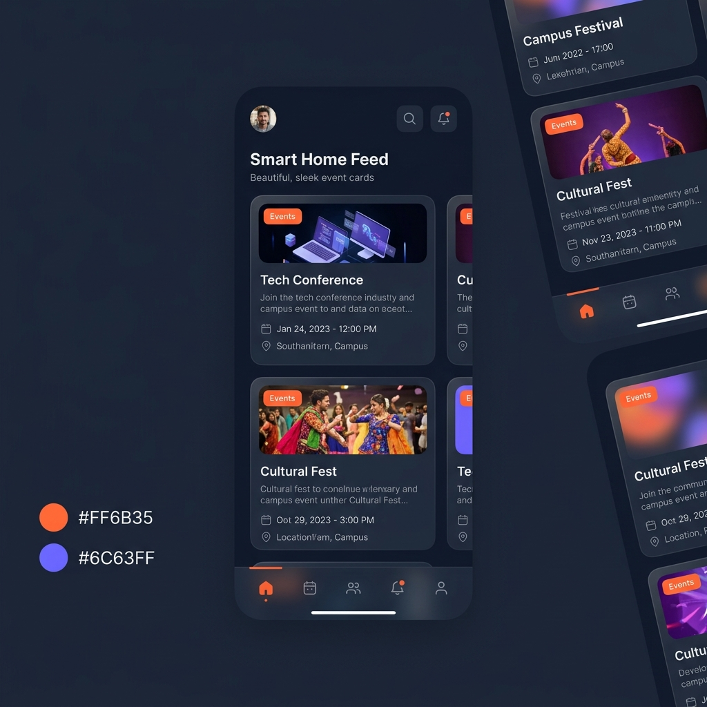
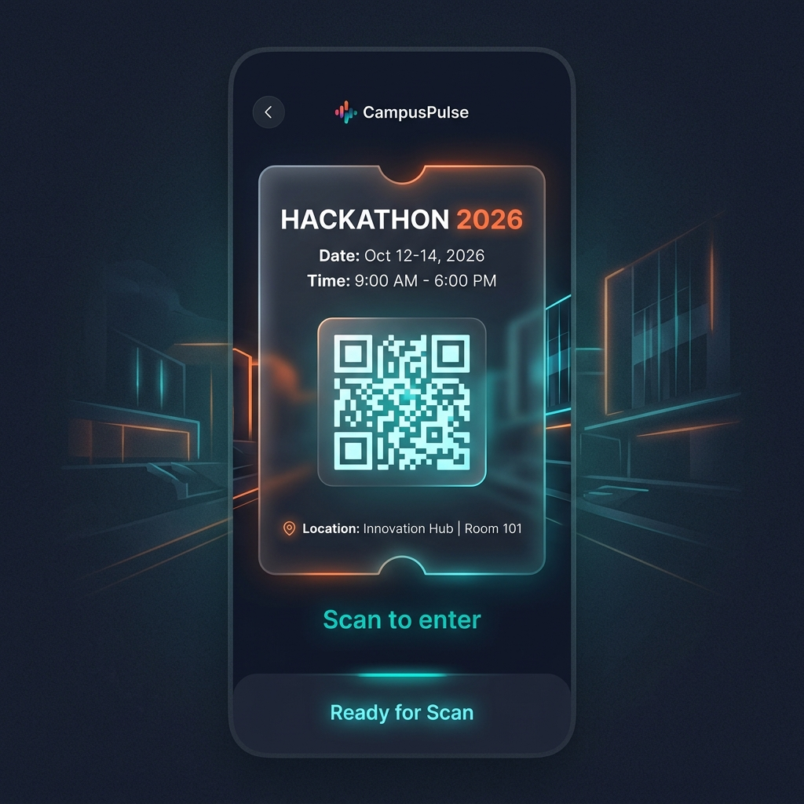
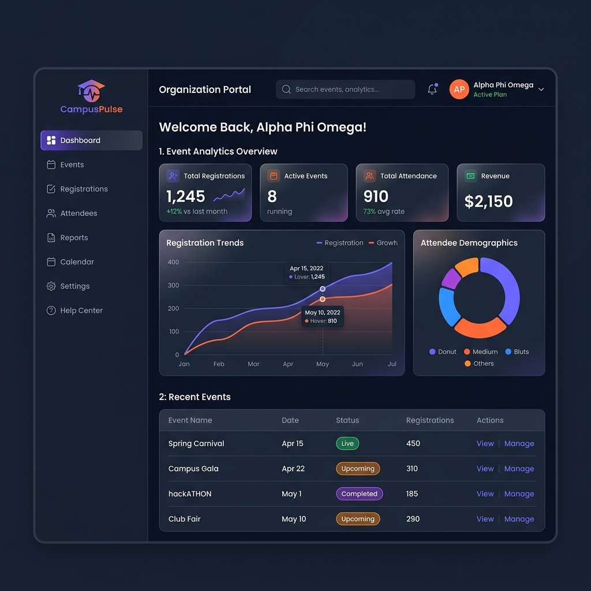

# 🚀 CampusPulse - Your Campus Event Companion

<div align="center">
  
  
  
  
  
</div>

<br />

<div align="center">
  
  &nbsp;&nbsp;&nbsp;
  
  &nbsp;&nbsp;&nbsp;
  
</div>

<br />

<div align="center">
  <strong>Discover events. Register instantly. Earn rewards. Build your campus identity.</strong>
</div>

---

## 📖 Overview

**CampusPulse** is a comprehensive campus event ecosystem that connects students, faculty, staff, and organizations through a gamified event discovery and engagement platform. Built with modern web and mobile technologies, it features FOMO-inducing elements and dopamine-boosting gamification to maximize user engagement.

## 🎯 Key Features

### For Students, Faculty & Staff (Mobile App)
- 🏠 **Smart Home Feed** - Personalized event recommendations based on interests
- 🔍 **Advanced Discovery** - Filter by domain, category, location, and date
- 📱 **One-Tap Registration** - Pre-filled profiles for instant signup
- 🎟️ **QR Tickets** - Digital tickets for seamless check-in
- ⚡ **Points & Rewards** - Earn points for attending events
- 🏆 **Leaderboard** - Compete with fellow students
- 🏅 **Badges** - Unlock achievements at 10, 15, 20+ events
- 📊 **Yearly Wrap** - Spotify-style annual recap with social sharing
- 🛍️ **Merchandise Store** - Redeem points for club goodies

### For Organizations (Web Portal)
- 📝 **Event Creation** - Multi-step wizard with audience targeting
- 📊 **Analytics Dashboard** - Track registrations, attendance, and ratings
- 📱 **QR Scanner** - Mark attendance and award points instantly
- 🎁 **Merchandise Management** - Release point-redeemable products
- 🏢 **Organization Profile** - Branding, verification, and analytics

### For Guests (Web Portal)
- 🌐 **Public Events** - Browse events open to external visitors
- 📋 **Simple Registration** - No campus ID required

## 🛠️ Tech Stack

### Frontend
| Platform | Technology |
|----------|------------|
| Web | Next.js 15, React 19, Tailwind CSS |
| Mobile | React Native, Expo |
| Styling | Glassmorphism, CSS Animations |
| Icons | Lucide React, Feather Icons |

### Backend
| Service | Technology |
|---------|------------|
| Database | Firebase Firestore |
| Authentication | Firebase Auth |
| Storage | Firebase Cloud Storage |
| Functions | Firebase Cloud Functions |

## 📁 Project Structure

```
CAMPUS-PULSE/
├── web/                          # Next.js Web Application
│   ├── src/
│   │   ├── app/
│   │   │   ├── page.tsx              # Landing page with role selection
│   │   │   ├── auth/
│   │   │   │   ├── login/            # Login page
│   │   │   │   └── signup/           # Multi-step signup
│   │   │   ├── organization/
│   │   │   │   ├── dashboard/        # Org dashboard
│   │   │   │   ├── events/create/    # Event creation wizard
│   │   │   │   ├── analytics/        # Analytics dashboard
│   │   │   │   ├── scanner/          # QR code scanner
│   │   │   │   └── onboarding/       # Org setup flow
│   │   │   └── guest/
│   │   │       └── events/           # Public events portal
│   │   ├── lib/firebase/             # Firebase configuration
│   │   ├── types/                    # TypeScript types
│   │   └── constants/                # App constants
│   └── package.json
│
├── mobile/                       # React Native Expo App
│   ├── App.tsx                       # Main home screen
│   ├── src/
│   │   ├── screens/
│   │   │   ├── ProfileScreen.tsx     # User profile & stats
│   │   │   ├── LeaderboardScreen.tsx # Campus rankings
│   │   │   ├── EventDetailScreen.tsx # Event info & QR ticket
│   │   │   ├── MerchandiseScreen.tsx # Rewards store
│   │   │   └── YearlyWrapScreen.tsx  # Spotify-style recap
│   │   └── constants/
│   │       └── theme.ts              # Color palette & design tokens
│   └── package.json
│
├── shared/                       # Shared Code
│   ├── types/                        # Common TypeScript types
│   └── constants/                    # Common constants
│
└── IMPLEMENTATION_PLAN.md        # Detailed project documentation
```

## 🚀 Getting Started

### Prerequisites
- Node.js 18+
- npm or yarn
- Firebase project (see [FIREBASE_SETUP.md](./FIREBASE_SETUP.md) for detailed instructions)

### Web Application

```bash
# Navigate to web directory
cd web

# Install dependencies
npm install

# Create .env.local with Firebase config
NEXT_PUBLIC_FIREBASE_API_KEY=your_api_key
NEXT_PUBLIC_FIREBASE_AUTH_DOMAIN=your_auth_domain
NEXT_PUBLIC_FIREBASE_PROJECT_ID=your_project_id
NEXT_PUBLIC_FIREBASE_STORAGE_BUCKET=your_storage_bucket
NEXT_PUBLIC_FIREBASE_MESSAGING_SENDER_ID=your_sender_id
NEXT_PUBLIC_FIREBASE_APP_ID=your_app_id

# Start development server
npm run dev
```

### Mobile Application

```bash
# Navigate to mobile directory
cd mobile

# Install dependencies
npm install

# Start Expo development server
npx expo start

# Scan QR code with Expo Go app on your phone
```

## 🎨 Design System

### Color Palette
| Color | Hex | Usage |
|-------|-----|-------|
| Primary | `#FF6B35` | CTAs, highlights |
| Secondary | `#6C63FF` | Accents |
| Tertiary | `#00BFA5` | Success states |
| Background | `#0F172A` | Dark theme |
| Surface | `#1E293B` | Cards, panels |

### FOMO Elements
- 🔴 **Live Counters** - Real-time registration updates
- ⏰ **Countdown Timers** - Registration deadlines
- 🔥 **"Almost Full" Badges** - Urgency indicators
- 👥 **Friend Attendance** - Social proof

### Dopamine Boosters
- ⚡ **Points Animation** - Reward feedback
- 🎉 **Confetti Effects** - Achievement celebrations
- 📈 **Progress Rings** - Visual goal tracking
- 🏅 **Badge Unlocks** - Milestone rewards

## 📊 Database Schema

### Collections
- `users` - User profiles and stats
- `organizations` - Club/org data
- `events` - Event details
- `registrations` - Event signups
- `merchandise` - Reward items
- `redemptions` - Point redemptions
- `notifications` - User notifications

## 🔐 Security

- Firebase Authentication with email/password and Google OAuth
- Firestore Security Rules for data protection
- QR token verification for attendance
- Role-based access control

## 🤝 Team

**V3CT0R SYND1CAT3S**

Built with ❤️ for the hackathon.

## 📄 License

MIT License - feel free to use and modify!

---

<div align="center">
  <strong>CampusPulse - Making Campus Events Unforgettable 🎉</strong>
</div>
